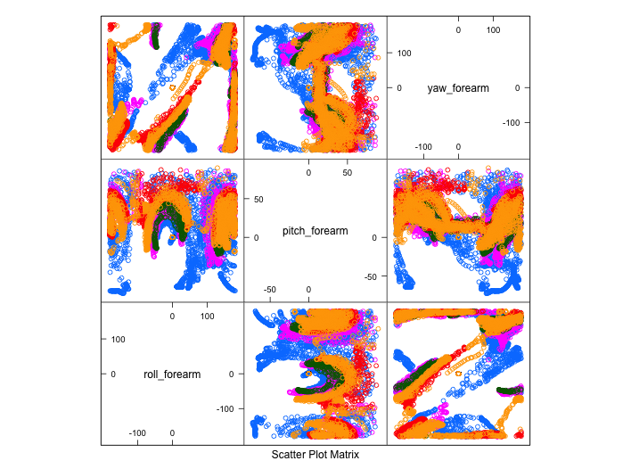

### **Project Summary**

Given data from the study "Qualitative Activity Recognition of Weight Lifiting Exercises", use Machine Learning to interpret the data from the sensors and define a benchmark of a correct dumbbell lift.

Required to build a model which could correctly predict all the observations in the 20 different test cases.

---

### **CONTENTS**

1. HOW MODEL WAS BUILT
2. HOW CROSS VALIDATION WAS HANDLED
3. EXPECTED OUT OF SAMPLE ERROR OF FINAL MODEL
4. EXPLANATION OF DECISIONS MADE

---

### **HOW THE MODEL WAS BUILT**

I read the paper to gain a better understanding of the background to the project and the methods that the researchers used and the results they gained. They managed to achieve a 98.2% weighted accuracy rate using a random forest method and 78.2% using leave-one-subject-out method (conclusion 5.3).

This gave me an idea of the benchmark to aim for, 78.2% - 98.2%. And potential methods to use.

We were presented with a data frame with 160 variables and 19622 rows. So my first step was to look at the structure of the data. For this I created a number of feature plots linking the outcome we are trying to predict ('classe') with a number of features.

I tried a range of plots. From features generated from sensors in the same areas of the body (i.e some raw features from forearm the forearm in example below), to features classed by type (e.g. all yaw readings).  However I made little progress with just looking at the data to identify key predictors.

I wrote an R function to cycle through each column and record its mean to standard deviation ratio which I hoped would highlight a few columns which needed cleaning up but found the sheer number of predictors too many to reduce down.

Finally I broke columns up again into raw data readings (accelerator, gyroscope and magent), first derivates of the raw data (e.g. pitch roll & yaw) and second derivatives (kurtosis, average, standard deviations etc.).  Again patterns eluded me so I progressed onwards to investigating models.

This exploration process *did* give me some understanding of the data structure.

- The predictors recorded were very skewed. Plotting a number of histograms for a range of predictors showed this
- A large number of predictors were comprised of a large number of NA (missing values). From using the `summary()` function
- Some of the data had no predictive value. The first 7 columns; X; user name; raw time stamp part 1; and 2; cvtd timestamp; new window; num window. Could all be removed since they were not linked to outputs from sensors.

My next step was to train different models in order to
- see if I could eliminate any further predictors
- potentially help with feature creation
- understand how the accuracy of each model compared to the benchmark
- understand what the in and out-of-sample error rates were for each model

Two methods were used to train models  
1. Tree - with cross validation  
2. Random Forest  

First steps as ever for each of these models was to split the training data into testing and training sub-samples. So I could train the models on this data (or subsets of the training sets) before choosing a final model and running it on the final Test set.

I used a fairly standard split of 70% for training (13737 rows) and 30% for testing (5885 rows).

### Building the Tree Model  
I found that Tree algorithms do not like data which is non-numeric. Presenting the data frame 'as is' caused R to crash. As there were a range of data classes present in data the first effort in readying the data was to convert the training and test sub sets to numeric class.

After that I ran the Caret "rpart" method and found it was quite slow.  Searching on the discussion boards I saw that other students found the `rpart()` function was faster, so I used this instead and found a faster performance.

*Cross Validation*  
Since I wasn't initially sure if Tree alogrithms used cross validation (I subsequently found out they do) I split the tree testing data further using 3 folds. For each of these training sets a model was trained and the accuracy recorded to be compared to the other 2.

*Out of Sample Error*  
I wrote a loop to train and then test on each of the 3 folds in turn and record from each fold the in and out of sample accuracies.  The output of which was;

                                Fold 1      Fold 2  Fold 3
                 In Sample     0.7580258 0.7324451 0.7452779
                 Out of Sample 0.7561224 0.7228123 0.7310062

As expected the out of sample accuracy was slightly lower than the in sample for each.  The overall out of sample accuracy was 72.8% giving an out of sample error rate of 27.2%.

*Conclusion*  
Model performed close to lower bound of the benchmark from the research paper but did not outperform.

### Building the Random Forest Model  
Another discovery (whilst trying to train a Gradient Boosting Model) was that 53 of the predictors were near zero value. These near zero values I felt would impede the random forest model.

I also knew that alot of the data had missing values so I trained a model using the knn impute method to try and get around this.

*Cross Validation*  
Cross validation is handled within the random forest algorithm.  Using the `trainControl(method="cv", number=5)` setting selected 5 fold cross validation.

*Out of Sample Error*  
Three models were trained using the Caret package model of Random Forest. One model was trained on all available predictors, the other with near zero value predictors removed and the final used knn Imputing to account for missing values as well zero values removed.

1. Including All Predictors  
The confusion matrix from the training set gives a 100% accuracy reading.  
The confusion matrix from the test set gives a 83% accuracy reading.

Like the Trees model the test set produces a lower out of sample estimate of accuracy as expected.  The out of sample accuracy also managed to get above the lower bound of the benchmark.

2. Removing Near Zero Value Predictors  
This process reduced the number of predictors down to 100.
The accuracy of the model on the training set (in-sample) was again 100%.
The accuracy of this model on the test set (out-of-sample) was 85%.

3. K Nearest Neighbours Imputing  
This method also incorporated near zero value removal but also estimated missing values using knn preprocessing method directly in the Caret train function.
In sample accuracy 100%
Out of sample accuracy 85.2%

*Conclusion*  
All three models performed within the benchmark range so could be put forward for consideration as a final model.

---

### FINAL MODEL SELECTION  
My final model selection was based on the out of sample error rate of the models that I managed to train.

*Out of Sample Error Rates*  
Trees - 27.2%  
Random Forest (near zero included) - 17%  
Random Forest (near zero removed) - 14.8%  
Random Forest (knn imputed) - 14.8% 

*Final Model*  
The preferred model to generate the predictions on the supplied 20 observations was the Random Forest with missing values pre processed using the knn imputed method.

Even though the out of sample error rate was the same as near zero removed only, I felt the knn method for dealing with missing values gave it flexibility in dealing with new data that the other models would not have.

*Running Test*  
When it came to running the test with my selected model I found that there were a large number of columns with missing values in the *test* data.  When I tried to remove them using the `complete.cases()` function I was left with no observations since there were no complete columns.

This meant I had to fall back on the Trees model.  Which correctly predicted 14 of the 20 test cases.

*Conclusion*  
Although disappointed that I couldn't get the random forest model working on the final test set, I know where I went wrong and I know that the R code to overcome the problem is available with more searching.

With more time I would also liked to have looked at engineering further features.

However even basic Tree the model used predicted with a 70% accuracy.  But am sure the Random Forest model would have performed even better.